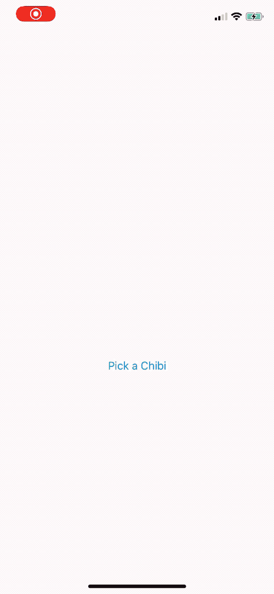

# ChibiStudio picker

Allows apps to let their user pick chibis from [ChibiStudio](https://apps.apple.com/app/chibistudio-avatar-maker/id1135307199).



# Using the ChibiStudio picker API

Since version 2.6, ChibiStudio offers a way for other apps to get content from the app. This is especially useful if users can pick avatars in your app and you’d like for them to be able to access their chibis and use them as avatars, but it can be used with any app that works with images.

Here’s how the feature works:
- Your app checks to see if ChibiStudio is installed
- Your app opens a special URL that launches the picker in ChibiStudio
- ChibiStudio returns the user to your app, using your URL scheme, when the user has finished picking their chibi
- By the time ChibiStudio calls your app, the pasteboard will contain a PNG representation of the chibi that was picked by the user

## Using the ChibiPicker class

To make the process simpler, we offer a `ChibiPicker` class that abstracts away most of the steps described above. [You can download it from Github](https://gist.github.com/insidegui/4f7bf7c81a7e24aef55061c9e40c9b0b) and just add it to your Xcode project (it’s a very simple class).

The first step is to make sure you have the `LSApplicationQueriesSchemes` key in your app’s Info.plist. That’s so your app can check if the user has ChibiStudio install with the `NSApplication.canOpenURL` method (which is called automatically in `ChibiPicker`’s implementation, but feel free to check manually if you have to).

You’ll also need a custom URL scheme. If your app already has a custom URL scheme, you don’t have to create a new one, just make sure you set the `returnURL` property in the `ChibiPicker` to match your custom URL scheme. [Check out Apple’s documentation](https://developer.apple.com/documentation/uikit/inter-process_communication/allowing_apps_and_websites_to_link_to_your_content/defining_a_custom_url_scheme_for_your_app?language=swift) for more information on custom URL schemes.

## Opening the chibi picker

To open the chibi picker, just call `ChibiPicker.shared. pickChibi(with:)` method. The completion handler is called with an `UIImage` when the user goes back to your app after interacting with ChibiStudio. If the value in the completion is `nil`, it means that the user hasn’t picked a chibi or that ChibiStudio is not installed, or couldn’t be opened.

Keep in mind that this completion handler may not be called if the user leaves the app without doing any action, so don’t block your user interface while waiting for a chibi to arrive.

Check out the sample project in this repo to see a practical implementation.

### If you DON’T use the new `UIScene` APIs

For apps which are not using the new `UIScene` APIs on iOS 13, the implementation has to be done in the AppDelegate, in the `application(open:options:)` method:

```swift
func application(_ app: UIApplication, open url: URL, options: [UIApplication.OpenURLOptionsKey : Any] = [:]) -> Bool {
    if ChibiPicker.shared.handleOpenURL(url) {
        // URL was a chibi picker URL
        return true
    }

    // Your own URL handling code...
}
```

### If you use the new `UIScene` APIs

If your app uses the new `UIScene` APIs on iOS 13, you need to add the following call in your SceneDelegate’s `scene(_ scene: UIScene, openURLContexts URLContexts: Set<UIOpenURLContext>)` implementation:

```swift
func scene(_ scene: UIScene, openURLContexts URLContexts: Set<UIOpenURLContext>) {
    if let url = URLContexts.first?.url {
        if ChibiPicker.shared.handleOpenURL(url) {
            // URL was a chibi picker URL
            return
        }

        // Your own URL handling code...
    }
}
```
